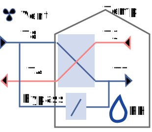
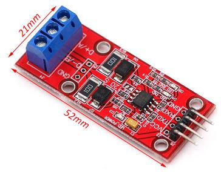
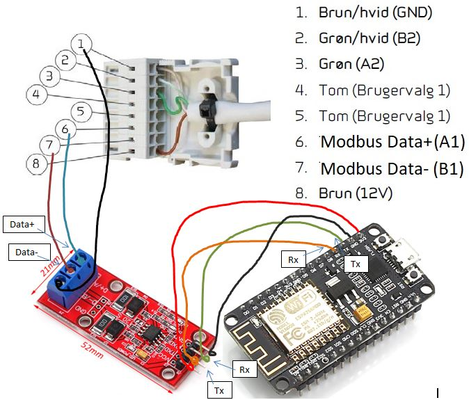

# Unofficial gateway for Nilan ventilation system

This little cool project lets you control your Nilan air vent system. Eg. Used with Nilan Comfort 300 LR combined with the CTS602 panel. And should be compatible with other models.

Can be used with Openhab, Home Assistant, Node-red or anything else your heart desires.

Easy compile source code via Platform.io setup.

This is a fork of https://github.com/jascdk/Nilan_Homeassistant

Which in turn is a fork of https://github.com/DanGunvald/NilanModbus

# How to use:
You can use this either via MQTT messages or via web request

## Web
You can get some json values from the Nilan by calling to it via HTTP. Just use your browser and type:

`http://[ip]/help` - This should give you som registers

`http://[ip]/read/app` - This would for example give you some status of the output

`http://[ip]/get/[adress]/[amountOfAdresessToRead]/[0=InputRegister(default),1=HoldingRegister]`- This would make you able to read raw data from controller 

`http://[ip]/set/[group]/[adress]/[value]`- This would make you able to send commands through HTTP 

e.g

`http://10.0.1.16/read/app` This is a great starter to give you info about the modbus connection being ok as this reads from the safest area of the modbus registers. Other commands might fail as controller don't know the status of the requested index e.g. if sensor is not connected or optional board is not connected.

`http://10.0.1.16/get/610/6/1` Will return read values of addresses 610-615 in holding register range. 

`http://10.0.1.16/set/control/1004/2700` This will set your temperature to 27 degrees. 

## Getting values by MQTT:

There is a lot of topics to be found here. I recommend using "MQTT Explorer" to se what is published.

### Listen

Here are some to listen on:

`ventilation/temp/#`- This will give the temperatures from all the sensors.

`ventilation/moist/#`- This will give the humidity from the systems humidity sensor.

`ventilation/#` - This gives the output of the system - fan speed etc. Remember the payloads are given in values not text.

### Write back

Here are all commands you are able to send back for controlling it. I recommend sending the commands as retained messages to make sure that any faults or reboot of the controller does not affect the outcome. Retained messages are cleared once the command is accepted.

| Command | Input |Description |
| ---   |---| ---|
|`ventilation/cmd/ventset`| 0-4 | Set ventilation speed |
|`ventilation/cmd/modeset`| 0-4 |Actual operation mode.0=Off, 1=Heat, 2=Cool, 3=Auto, 4=Service |
|`ventilation/cmd/runset`| 0-1 | User on / off select (equal to ON/OFF keys) |
|`ventilation/cmd/tempset`| 500-2500 | Set temperature to celsius * 100 |
|`ventilation/cmd/programset`| 0 - 4 | Start week program index |
|`ventilation/cmd/update`| 1 | Gateway has OTA active always but can be hard to reach if sometime. This puts gateway into OTA update mode for 60  seconds.  |
|`ventilation/cmd/reboot`| 1 | Reboots gateway |
|`ventilation/cmd/version`| 1 | Reports compiled date back |

# Installation
Should run on most ESP8266 boards like: wemos D1 mini or nodeMCU.

## Config
Edit configuration.h file to your liking including settings for wifi and mqtt broker.

## Upload to hardware
I recommend using platform IO https://platformio.org/ inside Visual Studio Code as dependencies will be downloaded automatic in most cases due to the `platformio.ini` file.

## Make electrical connection
You can use both a hardware interface or a software one. In theory they both should give the same result but I tent to use the hardware one in production setup and the software one during debugging to allow debug messages via serial port.

Connect Tx of ESP to Rx on RS485 board. And Rx of ESP to Tx of RS485 board.

RS485 I used: [MAX3485 Module TTL To RS485 Module MCU](https://www.aliexpress.com/item/32828100565.html)

This is my setup with the Nilan HMI still connected and working fine:

